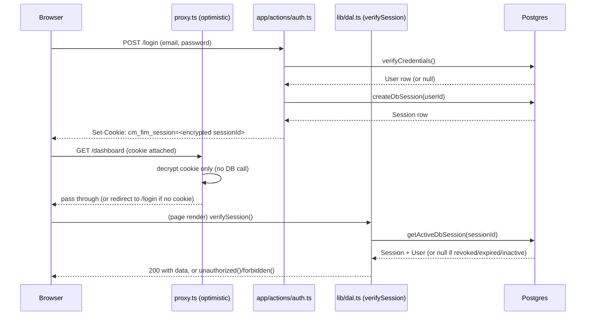

# Auth & RBAC — M3

Status: implemented (`lib/session*.ts`, `lib/dal.ts`, `lib/scoped-db.ts`,
`lib/audit.ts`, `app/actions/auth.ts`, `app/login/`, `app/dashboard/`,
`proxy.ts`) · verified against a real Postgres instance and over real HTTP
(see "Verification" below).

Covers: credential-based login/logout, database-backed sessions, a Data
Access Layer other modules build on, role gating, org-scoping, and a
reference protected API route. This is the foundation M4 onward builds
protected pages/actions/routes against.

## How it fits together

## Design decisions and why

**Hand-rolled auth (DB sessions + encrypted cookie + DAL), not Auth.js.**
This Next.js version's own bundled docs
(`node_modules/next/dist/docs/01-app/02-guides/authentication.md`)
document this exact pattern as the recommended approach when a system
doesn't need OAuth/social login. CM FIM System has 9 fixed, fleet-specific
roles and org-scoping requirements that don't map cleanly onto an
OAuth-provider-shaped library — carrying that dependency would fight its
conventions more than it would save. The whole flow (session model, cookie
encryption, DAL, `unauthorized()`/`forbidden()`) totals a few hundred lines
across the files listed above.

**Cookie holds only an encrypted `{ sessionId }`, never session contents.**
`Session` is a real Postgres table (`userId`, `expiresAt`, `revokedAt`).
The browser cookie (`cm_fim_session`, HS256-signed via `jose`) is opaque —
just enough to look the row up. This is what makes revocation real: an
admin invalidating a session (or a user logging out) sets `revokedAt`, and
the very next request is rejected regardless of how long the signed cookie
would otherwise remain valid. A pure stateless-JWT design can't do this
without a separate revocation-list mechanism. Verified directly — see
"Verification" below.

**`proxy.ts` only decrypts the cookie; it never queries the database.**
Per this Next.js version's own guidance: Proxy runs on every request,
including prefetches, so it has to stay fast, and is documented as
explicitly *not* a substitute for the real check. It exists only to
redirect obviously-wrong requests early (no cookie → protected route;
cookie present → `/login`). The actual authorization decision — is this
session still valid in the database — is made by `verifySession()` in
`lib/dal.ts`, called from every protected Server Component, Server Action,
and Route Handler. `proxy.ts` failing open or being misconfigured would
degrade UX (an extra bounce through a page that then 401s), not security.

**`unauthorized()`/`forbidden()`, not manual `redirect()`, for access
control.** This Next.js version ships first-class primitives for exactly
this (`experimental.authInterrupts` in `next.config.ts`): `unauthorized()`
throws a real 401 and renders `app/unauthorized.tsx`; `forbidden()` throws
a real 403 and renders `app/forbidden.tsx`. Using them means Route
Handlers get correct HTTP status codes for free, not just a page redirect
that would be meaningless to an API caller — the same `verifySession()` /
`requireRole()` calls work unmodified in Server Components, Server
Actions, *and* Route Handlers (see `app/api/me/route.ts`).

**`requireRole()` is a per-call allow-list, not a precomputed permission
matrix.** With no business modules built yet (M4-M14 haven't landed), a
granular action-to-permission mapping today would be guessing at needs
that don't exist yet. Each module states its own allowed roles as it's
built (`requireRole(session, "CLAIMS_MANAGER", "ORG_ADMIN")`), consistent
with docs/RULES.md's "module-specific rules added incrementally" approach.
Revisit this if/when the number of role checks per module makes a
centralized matrix clearly worth it.

**`scopedDb(organizationId)` — a Prisma Client Extension, not just
service-layer discipline.** Every read/update/delete on an org-scoped
model (the 17 listed in `lib/scoped-db.ts`) gets `organizationId` merged
into its `where` automatically. A developer forgetting to filter by org in
a new service function becomes structurally hard to do, not just a
code-review catch — appropriate given the failure mode (a cross-tenant
data leak) is severe. `lib/scoped-db.guard.test.ts` parses
`prisma/schema.prisma` directly and fails if a model with an
`organizationId` column is missing from the hand-maintained
`ORG_SCOPED_MODELS` list (or vice versa), so the list can't silently drift
from the schema.

What `scopedDb()` deliberately does **not** cover, so it isn't mistaken for
more than it is:
- **Nested relation reads/writes** (`db.claim.create({ data: { survey:
  { create: {...} } } })`) are not scoped — only the top-level model's own
  `where`/results are filtered. A service creating nested records still
  must set `organizationId` correctly on each nested create itself
  (Prisma's own required-field typing already forces this for `create`).
- **`upsert`** is excluded from the injected operations entirely — adding
  `organizationId` to its `where` would make a cross-org row "not found"
  and fall through to `create`, which then collides on the primary key
  instead of failing cleanly. Use `findFirst` + `create`/`update` instead
  of `upsert` on org-scoped models.
- **Raw queries** (`$queryRaw`, `$executeRaw`) are never touched by this
  extension.
- It wraps the plain `db` client, not a transaction (`tx`) — Prisma's
  interactive-transaction client doesn't expose `.$extends()` (confirmed
  empirically: it's missing from the `tx` object's own method list). Code
  needing both a transaction and org-scoping has to apply the
  `organizationId` filter itself inside that transaction.

This is defense-in-depth on top of correct service code, not a substitute
for it.

**`recordAudit()` (`lib/audit.ts`) is the single write path for
`AuditLog`, established now.** BR-08 requires every important action to
create an audit record. Rather than each future module inventing its own
`db.auditLog.create(...)` call, M3 establishes the one shape everyone
calls into — demonstrated end-to-end by `performLogin` recording a `LOGIN`
audit entry on every successful sign-in (`sourceChannel: "WEB"`).

**bcryptjs over argon2/bcrypt (native bindings).** No native compilation
step, so it can't break the Alpine Docker build the way native modules
sometimes do — the same reasoning that led to the `pg` driver adapter for
Prisma instead of the native query engine (see `docs/SCOPE.md`). 12 salt
rounds.

**Login failure messages don't distinguish "unknown email" from "wrong
password."** `verifyCredentials()` returns `null` for both cases (and for
an inactive account, and for a user with no password set), so the login
form can't be used to enumerate valid email addresses.

## Verification

- **`lib/password.test.ts`** — hash/verify round-trip, wrong-password
  rejection, salt randomness.
- **`lib/session-crypto.test.ts`** — cookie encrypt/decrypt round-trip;
  missing, malformed, and wrong-secret tokens all resolve to `null` rather
  than throwing.
- **`lib/scoped-db.guard.test.ts`** — `ORG_SCOPED_MODELS` cross-checked
  against `prisma/schema.prisma` directly.
- **`lib/scoped-db.test.ts`** (real Postgres) — cross-org `findMany`
  filtering, cross-org `findUnique` returns `null` rather than the other
  org's row, a cross-org `update` throws rather than silently no-op'ing,
  and a model with no `organizationId` column (`Session`) passes through
  unaffected.
- **`lib/auth.integration.test.ts`** (real Postgres) — `verifyCredentials`
  across correct/wrong/unknown/inactive cases; DB session
  create/retrieve/revoke/expire lifecycle; `performLogin` end-to-end
  including the `LOGIN` audit entry.
- **`lib/dal.test.ts`** — `requireRole()` allow/deny.
- **Real HTTP, against the built app** (`next build` + the standalone
  server, not just tests): unauthenticated `GET /dashboard` → `307` to
  `/login`; unauthenticated `GET /api/me` → `401`; authenticated (via a
  session row created the same way `performLogin` does) `GET /dashboard`
  → `200` rendering the signed-in user's name/email/role; authenticated
  `GET /api/me` → `200` with the expected JSON; authenticated `GET /login`
  → `307` to `/dashboard`; **after revoking that session row directly in
  Postgres, the same still-validly-signed cookie gets `401` on both
  routes** — the concrete proof that revocation actually works, not just
  that the JWT itself is well-formed.

## Open items for a later milestone

- No password-reset / forgot-password flow yet — out of scope for M3 as
  scoped; needs an email-sending capability (M13) to be meaningful anyway.
- No "list my active sessions" / "log out of all devices" UI — the DB
  schema supports it (multiple `Session` rows per `User`), but there's no
  UI to build against yet.
- `SUPER_ADMIN`/cross-org access isn't specially handled anywhere yet
  (`scopedDb()` always filters to one org) — deferred until multi-tenant
  deployment is an actual requirement, per `docs/SCOPE.md`.
