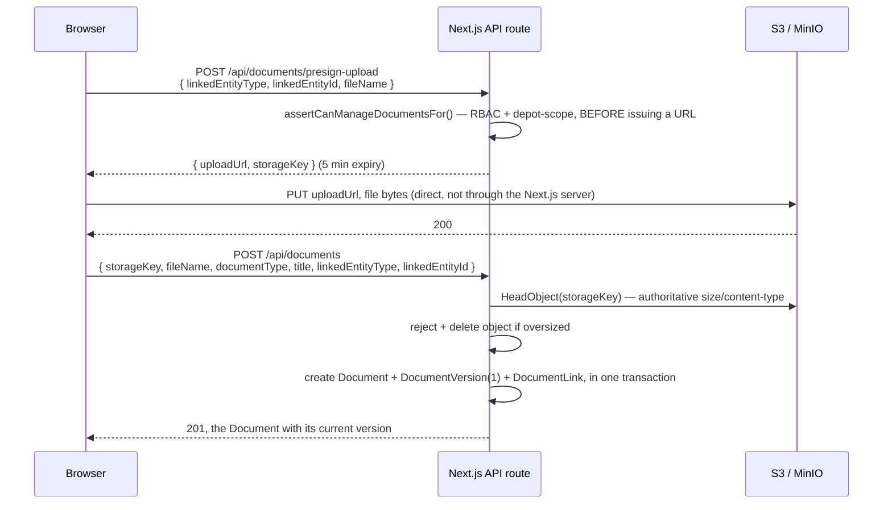

# Document Repository — M5

Status: implemented (`lib/documents/*.ts`, `lib/s3.ts`,
`app/api/documents/**`, one demo page) · verified against a real S3-
compatible server (see "Verification" below) and real HTTP against the
built app.

Covers: presigned-URL file upload to S3-compatible storage, versioning
(BR-04, building on the `Document`/`DocumentVersion` schema from M2a),
validity-date fields, and linkage to Vehicle/Driver (the `DocumentLink`
generic join from M2a). OCR extraction hook-up is **not** this milestone —
that's M11.

**Update (M19):** `lib/documents/link-scope.ts`'s `resolveDepotId()` grew
cases for `CLAIM`/`SURVEY`/`REPAIR_JOB`/`SETTLEMENT` — the pattern this
doc's own code comment predicted ("will each need a case added here once
their owning module exists"). Each new type's write RBAC mirrors that
entity's own module's `WRITE_ROLES` (e.g. a survey report is uploaded by
whoever can write a `Survey`), not the `VEHICLE`/`DRIVER` default. See
`docs/CLAIM_SUBRECORDS.md`.

**Update (M22):** an org-wide "Document Repository" page
(`/documents`) and a restyled Document Viewer (`/documents/[id]/ocr`)
landed on top of the M5/M11 service layer — no new schema. See
"M22: Document Repository + Viewer" below.

## M22: Document Repository + Viewer

**Scoped to VEHICLE-linked documents only — a deliberate narrowing, not
an oversight.** The design's Document Repository table (Bus No. /
Depot / Document / Title / Expiry / Status / OCR confidence) and its
mock data are 100% vehicle-linked — registration, insurance, fitness,
permit, PUC. Documents linked to `CLAIM`/`SURVEY`/`REPAIR_JOB`/
`SETTLEMENT`/`INCIDENT`/`DRIVER` have no natural place in a "bus no. /
expiry" table (a claim document has no bus number) and stay reachable
only from their own entity's own Documents tab, exactly as before this
milestone. `listVehicleDocuments()` (`lib/documents/document.ts`) is a
new, separate function from `listDocumentsForEntity()` — not an
extension of it — and `GET /api/documents` dispatches between the two
based on whether `linkedEntityType`/`linkedEntityId` are present (entity
mode, unchanged since M5) or absent (this new org-wide mode).

**Expiry status is computed, not stored.** `computeExpiryStatus(expiry,
now)` derives `VALID`/`EXPIRING_SOON` (≤30 days)/`EXPIRED`/`NO_EXPIRY`
from the existing `validityExpiryDate` at read time — no new column, no
background job keeping a stored status field in sync. The design's
"Missing" KPI tile (documents a vehicle should have but doesn't) is
dropped: nothing in the schema defines *which* document types are
required per vehicle, so "missing" isn't a computable status today, only
a policy decision nobody's made yet. The other three KPI tiles (Valid /
Expiring / Expired) are real, computed counts and link to `/documents`
pre-filtered by `?view=expiring`/`?view=expired`.

**OCR confidence is averaged, not per-field.** `OcrExtraction
.extractedFields` stores one confidence value per field (name, expiry
date, ...); the design shows one number per document. `averageOcrConfidence()`
takes the mean across a document's fields, rounded to a whole percent,
and returns `null` (not `0`) when there's no extraction yet — "hasn't
been OCR'd" and "OCR'd with 0% confidence" are different facts and the
UI (a progress bar + "—" vs "0%") treats them differently.

**"Request re-upload" reveals the real re-upload flow instead of being a
dead button.** The design implies notifying a specific person to
re-upload a document; there's no paging/notification mechanism in this
system (out of scope — would need a new model, not requested), so the
button reveals `components/documents/upload-new-version-form.tsx`, which
runs the actual M5 presign → PUT → complete new-version flow right where
the design places the action. Practical substitute, not a placeholder
that goes nowhere.

**`GET /documents`'s two response shapes are both real, not stubs.**
`Document` (entity mode) and `VehicleDocumentRow` (Document Repository
mode) are deliberately different shapes — the latter denormalizes
`vehicleRegistration`/`depotName`/`status`/`ocrConfidencePercent` because
the table renders directly from it with no follow-up fetch per row. See
`docs/openapi.yaml`'s updated `/documents` GET.

**Depot-scoped for `DEPOT_MANAGER`, same pattern as every list endpoint
in this codebase.** An explicit `depotId` filter for a depot outside a
`DEPOT_MANAGER`'s scope returns `[]`, not a bypass and not a confusing
empty result via an AND-ed query collision — the same call made in
M21's `listIncidents`.

## The upload flow

New versions of an existing document follow the same two-step shape
against `/api/documents/:id/versions/presign-upload` and
`/api/documents/:id/versions`.

## Design decisions and why

**Presigned URLs — the browser uploads directly to S3/MinIO, never through
the Next.js server.** The app server's job is authorization (deciding
*whether* an upload may happen and handing back a short-lived signed URL)
and bookkeeping (recording that it happened) — never moving the file bytes
themselves. This keeps the server's bandwidth/memory footprint flat
regardless of file size, which matters once video evidence (a later
milestone, same storage layer) is in play.

**The authoritative file size and content-type come from S3's own
`HeadObject`, never from client-reported values.** After the browser PUTs
the file, "complete" calls `HeadObjectCommand` before writing anything to
the database — a client could otherwise lie about either (report a small
size while uploading something huge, or claim a `mimeType` that doesn't
match the bytes). This also simplifies the "complete" request body: it
never needs to carry `fileSizeBytes`/`mimeType` at all.

**RBAC/depot-scoping is checked at presign time, not just at complete
time.** `assertCanManageDocumentsFor()` (`lib/documents/link-scope.ts`)
runs before a presigned URL is even issued — an unauthorized user never
gets a valid upload URL in the first place, not just a rejected "complete"
call afterward. It's checked again at complete time too (defense in
depth, since presign and complete are two independent requests).

**Document access is resolved through whatever it's linked to — currently
only VEHICLE and DRIVER.** `lib/documents/link-scope.ts` mirrors
`lib/masters/{vehicle,driver}.ts`'s RBAC exactly: ORG_ADMIN + DEPOT_MANAGER
can manage documents (create/version), DEPOT_MANAGER confined to their own
depot's vehicles/drivers (for both writes *and* reads, matching M4); every
other authenticated role reads org-wide. `INCIDENT`, `POLICY`, `CLAIM`,
`SURVEY`, `REPAIR_JOB` are already valid values in the `LinkedEntityType`
enum (M2a) but have no service/RBAC layer yet — linking a document to one
of them throws a clear "not supported yet" error rather than silently
succeeding with no access control. Each of those gets a case added to
`resolveDepotId()` when its owning module lands (M6 for Incident, M7+ for
the rest).

**A document has exactly one link, set at creation.** `CompleteNewDocumentSchema`
requires `linkedEntityType`/`linkedEntityId` — there's no "create an
orphan document, link it later" path in M5. Keeps scope-resolution
(`document.links[0]`) simple; revisit if a real need for multi-linked
documents (e.g. one estimate shared across two repair jobs) shows up.

**Storage keys are opaque UUIDs, not human-readable paths.**
`documents/{uuid}-{sanitized filename}`, the same shape whether it's a
brand-new document's first version or a later version of an existing one.
S3 keys don't need to be navigable by a person — they're only ever
resolved through the `DocumentVersion` row that owns them — so there's no
value in encoding `documentId`/version-number into the path, and doing so
would have needed a "rename" step to move a staging upload into a
canonical path (extra complexity for no real benefit).

**Presigned URLs expire in 5 minutes, both for upload and download.**
Long enough for a real upload/download to complete, short enough that a
leaked URL (logged somewhere, shared accidentally) stops working quickly.
Downloads are never a public bucket URL — every download goes through
`GET /api/documents/:id/download-url`, which re-checks read access before
minting a fresh signed URL.

**`DOCUMENT_MAX_FILE_SIZE_BYTES` is a runtime-configurable env var
(default 100MB), read fresh on every check rather than cached.** Doubles
as a real ops knob (tune the limit without a code change) and as the
mechanism that makes the size-limit rejection path actually testable
(`lib/documents/document.integration.test.ts` sets it to 5 bytes for one
test, rather than needing a 100MB fixture in the test suite).

## Deferred to a follow-up

- **Full document management UI.** M5 ships one demo page
  (`app/vehicles/[id]/documents/page.tsx`) with a bare upload form and a
  version-count list, proving the service/API layer end-to-end — not
  metadata editing, version-history browsing, or a documents view on the
  Driver side (the API/service layer already supports Driver, it just has
  no page yet).
- **Bulk/CSV-adjacent import.** Same reasoning as M4 — a distinct feature
  with its own UX questions.
- **Validity-date expiry alerting.** `validityStartDate`/`validityExpiryDate`
  are stored and can be queried, but nothing surfaces "this document
  expires soon" yet — that's M13 (Notifications/escalations)'s job, per
  `docs/SCOPE.md`.
- **Orphaned-upload cleanup.** A presigned upload that's issued but never
  completed (browser closed mid-upload, network failure) leaves an object
  in S3 with no DB row referencing it. Not cleaned up automatically — an
  S3 lifecycle policy (expire objects under `documents/` older than N
  days with no corresponding `DocumentVersion.storageKey`) would be the
  right fix, deferred until it's an actual operational problem rather than
  a theoretical one.
- **Content-type allow-listing / virus scanning.** Not enforced — a
  real content-security policy decision better made with actual
  requirements than guessed at now.

## Verification

- **`lib/documents/document.integration.test.ts`** (7 tests) — against a
  *real* S3-compatible server: [s3rver](https://github.com/jamhall/s3rver)
  started in-process in `beforeAll` (no Docker needed, unlike MinIO — see
  the note in `docs/SCOPE.md`/`README.md` about Docker Hub pulls being
  blocked in this sandbox). Every test exercises the actual presigned URL
  over real HTTP (`fetch(uploadUrl, { method: "PUT", body })`), not a
  mocked S3 client:
  - Full create flow: Document + first DocumentVersion + DocumentLink,
    with the stored `fileSizeBytes` matching what was actually uploaded
    (proving `HeadObject` is really what's used, not client input), plus
    a `CREATE` audit entry.
  - DEPOT_MANAGER can upload for their own depot's vehicle, forbidden for
    another depot's.
  - Oversized upload (via `DOCUMENT_MAX_FILE_SIZE_BYTES` set to 5 bytes
    for the test) is rejected, the S3 object is actually deleted
    (confirmed via a direct `HeadObject` 404), and no `Document` row is
    left behind.
  - New-version flow: version 2 created, `currentVersion` updated,
    `UPDATE` audit entry recorded.
  - A presigned download URL serves the exact bytes that were uploaded.
  - DEPOT_MANAGER cannot read a document linked to another depot's
    vehicle; a non-DEPOT_MANAGER role (CLAIMS_MANAGER) can.
  - `listDocumentsForEntity` returns only documents linked to the
    requested entity.
  - **`listVehicleDocuments` (M22, 1 test)** — 4 documents across 2
    vehicles/2 depots with distinct expiry dates confirm
    `VALID`/`EXPIRING_SOON`/`EXPIRED`/`NO_EXPIRY` are each computed
    correctly; an org-wide admin sees all 4, a `DEPOT_MANAGER` sees only
    their own depot's; `depotId`/`documentType`/`status`/`search` filters
    each work; a `DEPOT_MANAGER` explicitly filtering by another depot
    gets `[]`, not a leak.
- **Real HTTP, against the built app + a separately-started s3rver
  instance**: the full presign → PUT → complete → list → download-URL →
  fetch round trip via `curl`, confirming the exact uploaded file content
  comes back byte-for-byte through the download URL, and that the demo
  page renders the uploaded document's title.
