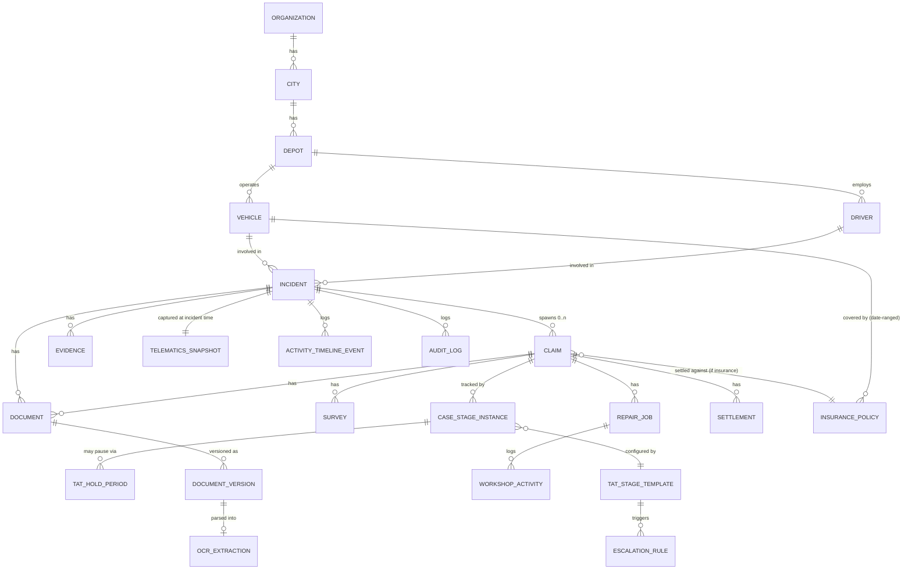

# CM FIM System — Phase 1 Scope & Delivery Plan

Status: **Draft for sign-off** · Owner: Engineering · Tenant at launch: JBM (multi-tenant-ready)

This document is the first deliverable requested by the development brief
("Architecture documentation"). It scopes Phase 1 into ordered, independently
shippable milestones, fixes the confirmed architectural decisions, and lists
what is deliberately deferred or still needs JBM/business input. No
application code is written yet — this is the plan the milestones below will
be built against, one PR at a time.

---

## 1. Confirmed decisions

| Area | Decision |
|---|---|
| Architecture | Modular monolith, single deployable Next.js app + BullMQ worker process. No microservices in Phase 1. |
| Frontend/backend | Next.js (App Router) + TypeScript + Tailwind CSS + shadcn/ui |
| Database | PostgreSQL + Prisma ORM |
| Object storage | S3-compatible (AWS S3 in prod, MinIO in local/dev via docker-compose) |
| Jobs/queues | Redis + BullMQ (reminders, escalations, OCR jobs, telematics polling) |
| WhatsApp | Meta WhatsApp Business **Cloud API**, integrated directly (no BSP), behind a `WhatsAppProvider` adapter |
| OCR | AWS Textract as the default `OCRProvider` implementation, behind a provider interface |
| Telematics | No JBM API access yet → ship a `TelematicsProvider` interface + deterministic stub/sandbox adapter for dev & demo; real JBM adapter is a later milestone once their API spec/credentials are available |
| Email | Provider-abstracted (`EmailProvider`); default implementation via SMTP/SES, configurable via env |
| IDs | UUID primary keys everywhere; human-readable business IDs (`INC-2026-000001`, `CLM-2026-000001`, `SUR-2026-000001`) generated per organization+year |
| Multi-tenancy | Single-tenant deployment for JBM in Phase 1, but every major business table carries `organization_id` from day one so a second tenant is a config change, not a migration |
| This session | **Scope only.** This document is committed for review; no further module is implemented until it's approved. |

---

## 2. Domain model (core entities)

The incident is the one parent record every downstream activity hangs off.
A claim (of any type) is *derived* from an incident, never re-keyed.



Key modeling rules baked into the schema design (Milestone M2):

- `incident` is never deleted or type-narrowed; `claim.claim_type` is an enum
  (`insurance`, `warranty`, `maintenance`, `operational`, `third_party_recovery`,
  `mixed`) and an incident can have **multiple** claims (e.g. one insurance +
  one third-party-recovery claim on the same accident).
- `case_stage_instance` is the generic TAT-tracked unit — one row per
  (claim or incident) × workflow stage, referencing a configurable
  `tat_stage_template` (per org, per case type). This is what makes the TAT
  engine and escalation hierarchy configurable rather than hard-coded.
- `tat_hold_period` records on-hold spans with `reason`, `responsible_party`,
  `started_at`/`ended_at`; TAT-elapsed calculations always subtract held time.
- `document_version` is append-only; `document.current_version_id` points at
  the active version. OCR results land in `ocr_extraction` as **proposed**
  field values with a `verified_by`/`verified_at` pair — they are never
  auto-applied to master data (`vehicle`, `driver`, `policy`, …).
- `telematics_snapshot` is written once at incident-report time and is
  immutable afterward — it is evidence, not a live feed.
- `audit_log` is populated by a single write path (a Prisma middleware /
  service-layer helper), not scattered `console.log`-style calls, so every
  mutating action is guaranteed to be captured the same way.
- Every table above (except pure lookup/enum tables) carries `organization_id`.

---

## 3. Module boundaries (modular monolith)

```
apps/web/                      Next.js app (UI + API routes)
  app/(dashboard)/...          Route groups per persona (corporate/depot/claims)
  app/api/...                  REST/OpenAPI route handlers (thin — delegate to services)
packages/
  domain-auth/                 Auth, RBAC, session, permission checks
  domain-masters/              Org/city/depot/vehicle/driver master data
  domain-documents/            Document repo, versioning, validity tracking
  domain-incidents/             Incident lifecycle, evidence
  domain-claims/                Claim lifecycle, incident→claim conversion
  domain-surveys/               Survey management
  domain-workshop/              Repair/workshop tracking
  domain-tat/                   TAT engine, hold periods, escalation hierarchy
  domain-policies/              Insurance policy repository + date-based selection
  domain-settlement/            Settlement, payment, closure controls
  domain-telematics/            TelematicsProvider interface + adapters (stub, JBM)
  domain-ocr/                   OCRProvider interface + adapters (Textract)
  domain-whatsapp/              WhatsAppProvider interface + Meta Cloud API adapter
  domain-notifications/         EmailProvider interface, reminders, escalations
  domain-audit/                 Audit log write path, query API
  shared-kernel/                organization_id scoping, ID generator, money/date value objects
workers/                       BullMQ worker process (reminders, escalation sweep, OCR jobs, telematics jobs)
prisma/                        Schema + migrations + seed
docs/                          Architecture, ADRs, OpenAPI specs, ER diagrams
```

Rule enforced from Milestone M1 onward: UI components (`apps/web/app/**`)
call domain package services — they never contain business rules, TAT math,
or direct Prisma queries for cross-cutting logic.

---

## 4. Milestone plan

Each milestone below is scoped to be one (or a few) reviewable PR(s), and per
the brief's instruction, **each module's DB schema, API contract, and
business rules/tests are drafted before that module is implemented** —
tracked as the first task inside the milestone, not skipped.

### First create

| # | Milestone | Delivers | Depends on |
|---|---|---|---|
| M1 ✅ | **Foundations** | Repo scaffold (Next.js/TS/Tailwind/shadcn), Docker Compose (postgres, redis, minio, app, worker), `.env.example`, lint/format/test tooling, this scope doc (no separate ADR log — see M1 decisions) | — |
| M2a ✅ | **Database schema — core** | Org/city/depot/vehicle/driver, users, document repository (versioned + OCR), incidents, evidence, telematics snapshot, activity timeline, audit log, human-readable ID generation. See [`docs/schema/M2A.md`](schema/M2A.md). | M1 |
| M2b ✅ | **Database schema — claims lifecycle** | Insurance policies, claims, surveys, workshop/repair jobs, TAT engine (stage templates, hold periods, escalation rules), settlement/payment. See [`docs/schema/M2B.md`](schema/M2B.md). | M2a |
| M3 ✅ | **Auth & RBAC** | Database-backed sessions, credential login/logout, role gating, org-scoping (Prisma Client Extension), protected Server Component/Action/Route pattern. See [`docs/AUTH.md`](AUTH.md). | M2a |
| M4 ✅ | **Vehicle/depot/driver master** | City/Depot/Vehicle/Driver CRUD (service layer + protected API routes + simple list pages), RBAC + depot-scoping, audit logging, tests. Bulk import and full create/edit UI deferred — see [`docs/MASTERS.md`](MASTERS.md). | M3 |
| M5 ✅ | **Document repository** | Presigned-URL upload to S3-compatible storage, versioning (BR-04), validity-date fields, linkage to Vehicle/Driver (Incident/Claim/Survey/RepairJob linking deferred to their own milestones). See [`docs/DOCUMENTS.md`](DOCUMENTS.md). | M4 |
| M6 ✅ | **Incident workflow** | Incident creation/editing, OPEN/CLOSED state machine, evidence attachment (presigned upload, reusing M5's pattern), `INC-YYYY-######` generation. Telematics snapshot deferred to M12. See [`docs/INCIDENTS.md`](INCIDENTS.md). | M4, M5 |
| M7 ✅ | **Claim workflow** | Incident→claim conversion (no re-entry), multi-claim-per-incident, claim types, BR-05 policy auto-selection by incident date, claim state machine (`CLM-YYYY-######`), plus surveys (`SUR-YYYY-######`) and workshop/repair job tracking, shipped alongside. See [`docs/CLAIMS.md`](CLAIMS.md). | M6, M2b |
| M8 ✅ | **TAT engine** | Configurable stage templates per org/case-type, auto-instantiated sequential `case_stage_instance` tracking, on-hold periods with reason/responsible party, elapsed-time calc excluding holds. Escalation firing deferred to M13. See [`docs/TAT.md`](TAT.md). | M7 |
| M9 ✅ | **Dashboards** | One shared operational dashboard (org-wide or depot-filtered, no mocks) — incident/claim status counts, TAT breach counts, aging buckets. See [`docs/DASHBOARDS.md`](DASHBOARDS.md). | M6–M8 |

### Then implement

| # | Milestone | Delivers | Depends on |
|---|---|---|---|
| M10 | **WhatsApp integration** | Meta Cloud API webhook intake, incident creation from WhatsApp messages, media download into evidence store, `WhatsAppProvider` interface | M6 |
| M11 ✅ | **OCR/document parsing** | `OCRProvider` adapter + a real deterministic stub, async extraction job (BullMQ), human-verification UI, master-data protection (BR-07 — no silent overwrite; a real Textract adapter is a follow-up pending AWS credentials). See [`docs/OCR.md`](OCR.md). | M5, BullMQ from M1 |
| M12 | **Telematics adapter + JBM integration** | `TelematicsProvider` interface, stub adapter for dev/demo, incident-time snapshot capture job, JBM adapter stub (real impl pending API access) | M6 |
| M13 ✅ | **Notifications/escalations** | Reminder scheduler (repeatable BullMQ job), configurable escalation hierarchy wired to `case_stage_instance` breaches, email delivery via a real `EmailProvider` stub. WhatsApp/SMS-channel firing deferred pending M10/an SMS adapter. See [`docs/ESCALATIONS.md`](ESCALATIONS.md). | M8 |
| M14 ✅ | **Payment & closure** | Settlement create + JBM response recording, payment recording + reconciliation, BR-09 closure-blocking rule (no `CLOSED` until every settlement is accepted, fully paid, and reconciled). Originally shipped as create/approve/reject; the response model (not an approval decision) was corrected in M19 — see [`docs/PAYMENTS.md`](PAYMENTS.md). | M7, M8 |
| M15 ✅ | **Testing & deployment hardening** | Full test pass (149 unit/integration tests + a real-HTTP e2e smoke script), a hand-maintained OpenAPI spec, a realistic multi-depot JBM seed dataset, deployment docs, and an ops runbook. See [`docs/DEPLOYMENT.md`](DEPLOYMENT.md) and [`docs/RUNBOOK.md`](RUNBOOK.md). | All prior |

Survey management and workshop/repair tracking are delivered inside M7/M8's
claim-lifecycle slice rather than as standalone milestones, since they are
sub-workflows of a claim with their own TAT stages — they get their own
schema/API-contract/tests pass but ship alongside the claim workflow PR(s).

### UI/UX alignment (Claims Mitra design)

A separately-produced UI design (`CM_FIM_System.dc.html`, branded "Claims
Mitra") surfaced after M15 shipped, describing a materially larger
information architecture than M1–M15 built against this document — 16
screens including a personalized "My Work" view, a Fleet dashboard, a
tabbed Vehicle profile, an org-wide Document Repository, a TAT dashboard,
MIS reports, an Administration area (Users/Master Data/Integrations), and
standalone detail pages for Survey/Repair/Settlement/Payment (today these
are inline tables on Claim Detail). It also introduced its own visual
design system (Poppins/Inter type, a purple accent palette, card/tag
styling) that the app doesn't use anywhere — every existing page is
plain shadcn/ui defaults. The gap was never something to notice earlier:
the design lived outside this repo and was never referenced by any prior
milestone until it was shared directly. See `docs/DEPLOYMENT.md`'s
sibling docs for how each milestone below gets verified — same bar as
M1–M15, no exceptions for being UI-focused.

| # | Milestone | Delivers | Depends on |
|---|---|---|---|
| M16 ✅ | **UI foundation** | The nav shell every other screen sits inside: sidebar (wordmark + "CM FIM" module tag, nav list), header (search input slot, notifications/help placeholders, signed-in user), and the design's color/type/spacing tokens adopted app-wide. No new data, no new routes — a shell + restyle. See [`docs/UI_FOUNDATION.md`](UI_FOUNDATION.md). | M1–M9 (existing pages get re-skinned in place) |
| M17 ✅ | **Global search** | Real search backend (incident/claim/vehicle number to start — driver/document expansion is a follow-up if narrow search isn't enough), wired into M16's header search box. See [`docs/SEARCH.md`](SEARCH.md). | M16 |
| M18 ✅ | **Administration: Users** | User list/create/deactivate + role assignment. Closes a real gap — there is currently no way to manage a user except direct database access. See [`docs/ADMIN_USERS.md`](ADMIN_USERS.md). | M16 |
| M19 ✅ | **Sub-record detail pages** | Survey/Repair/Settlement/Payment are standalone pages (each with its own tabs — full design tab sets, including new `RepairPart`/reused `Survey.findings`/`WorkshopActivity`/extended document-linking to back them), linked from Claim Detail instead of inline tables. **Bundles the settlement domain correction**: JBM is the insured, not an approving authority — the insurer settles the claim, the surveyor recommends the loss. `Settlement`'s `PENDING → APPROVED/REJECTED` flow (M14) is renamed/reworked to record JBM's *response* to the insurer's offer (`ACCEPTED` / `DISPUTED` / `REVIEW_REQUESTED` / `PENDING`), not an approval decision — this touched M14's shipped schema, API, BR-09's gate, tests, and `docs/PAYMENTS.md`. No monetary approval ceiling of any kind is implemented (confirmed not a JBM requirement); if JBM ever wants an internal financial-authority rule, it's optional config added only when JBM supplies the actual policy. See [`docs/PAYMENTS.md`](PAYMENTS.md) and [`docs/CLAIM_SUBRECORDS.md`](CLAIM_SUBRECORDS.md). | M14 (reworked), M16 |
| M20 ✅ | **Claim Detail: Communication + Audit tabs** | Claim Detail is now tabbed (Overview/Communication/Audit). Audit tab reuses the existing `AuditLog` directly via M19's `listAuditLogForEntity()`. Communication log is manually-entered notes (confirmed with the user), backed by the dormant M2b `ActivityTimelineEvent` model — no new schema. See [`docs/CLAIMS.md`](CLAIMS.md). | M16, M19 |
| M21 ✅ | **Incident List/Detail + Corporate Dashboard richness** | Incident List: CSV export, richer filters (severity/type/depot/date range). Incident Detail: the design's 7-tab layout (Overview/Evidence/Telematics/Documents/Assessment/Timeline/TAT) — Telematics stays a placeholder pending M12, Documents extends document-linking to `INCIDENT`, two new nullable `injuries`/`thirdPartyInvolved` fields. Corporate Dashboard: pipeline funnel (an interpretive relabeling of existing status counts) and per-depot performance breakdown, both on the same M9 aggregation — no new models beyond the two incident fields. See [`docs/INCIDENTS.md`](INCIDENTS.md) and [`docs/DASHBOARDS.md`](DASHBOARDS.md). | M16 |
| M22 | **Document Repository + Viewer** | Org-wide document list (today: per-vehicle only) with KPI tiles and OCR confidence column; Document Viewer restyled to the design (confidence bar, Verify/Flag/Request re-upload). Extends M5/M11, no new models. | M16 |
| M23 | **TAT Dashboard** | Live board of every in-progress case's TAT status, across incidents and claims. New aggregation query over M8's `CaseStageInstance`, no new models. | M16 |
| M24 | **MIS Reports** | Claim ageing, TAT compliance %, incident-type frequency, repair turnaround by depot. New aggregation queries, no new models. | M16 |
| M25 | **Fleet Dashboard** | Fleet-wide KPIs + filterable vehicle list (status, open incidents/claims). New aggregation query, no new models. | M16 |
| M26 | **My Work** | Personalized "needs your action" view, scoped to the caller. New query, no new models. | M16, M18 |
| M27 | **Administration: Master Data** | Turns free-text `surveyorName`/`workshopName`/insurer names into real, manageable master entities (Insurer/Broker/Surveyor/Workshop). Real schema migration — **needs a backfill plan** for every existing free-text value, not just new tables. | M16, M18 |
| M28 | **Vehicle Detail (tabbed profile)** | The design's 8-tab vehicle page. Information/Status/Incident-Claim-Repair history are queries against existing data. Warranty needs a new model — business terms (provider, coverage, validity) undefined, needs its own scoping question when this milestone starts. Telematics tab stays a placeholder pending M12. | M16 |
| M29 | **Administration: Integration Settings** | Status view of WhatsApp/Telematics/OCR/Email adapters. Needs a real "is this configured and reachable" check, not just echoing env vars — pair with closing `docs/DEPLOYMENT.md`'s flagged `/api/health` gap, same underlying check. | M16, M10/M12 (for real status, not just OCR/Email) |
| M30 | **"Mitra" AI assistant** | Read-only Q&A over live fleet/incident/claim data via the chat widget in M16's shell. `AssistantProvider` adapter (same pattern as `OCRProvider`/`EmailProvider`) — default unset resolves to a real deterministic stub (no API calls, no key needed); `ASSISTANT_PROVIDER=claude` + `ANTHROPIC_API_KEY` for the real thing, fails closed on an unrecognized provider name. Mitra calls a small fixed set of read-only tool functions, each wrapping an existing service-layer query with the asking user's real `AuthSession` — so `scopedDb()`/RBAC apply exactly as everywhere else, no parallel access model. Never writes anything; conversation history stays client-side/ephemeral for v1, not persisted. Usage logging and rate-limiting deliberately left as open questions, not built speculatively. | M16 |

Sequencing note: M16 is the one hard prerequisite for everything else in
this list (every other screen sits inside its shell). Beyond that, M17
and M18 are next since search and user management are assumed by nearly
everything downstream; the rest can reorder based on what's actually
wanted next.

---

## 5. Adapter interface contracts (shape, not implementation)

Fixed now so downstream milestones code against a stable contract:

```ts
interface WhatsAppProvider {
  verifyWebhook(query: Record<string, string>): string | null;
  handleIncomingMessage(payload: unknown): Promise<NormalizedInboundMessage>;
  sendMessage(to: string, message: OutboundMessage): Promise<{ providerMessageId: string }>;
}

interface OCRProvider {
  extract(documentVersionId: string, fileRef: StorageRef): Promise<{
    fields: Array<{ key: string; value: string; confidence: number }>;
    rawResponseRef: StorageRef;
  }>;
}

interface TelematicsProvider {
  getSnapshotAt(vehicleExternalId: string, atTimestamp: Date): Promise<TelematicsSnapshotData>;
  // Stub adapter (Phase 1 default) returns deterministic seeded data;
  // JbmTelematicsProvider implements the same interface once JBM's API is available.
}

interface EmailProvider {
  send(message: { to: string[]; subject: string; html: string; attachments?: StorageRef[] }): Promise<void>;
}

// M30 — read-only Q&A only; tools are existing service-layer queries
// called with the asking user's real AuthSession, so scopedDb()/RBAC
// apply exactly as everywhere else. Never a write path.
interface AssistantProvider {
  chat(
    session: AuthSession,
    messages: Array<{ role: "user" | "assistant"; content: string }>,
    tools: AssistantTool[],
  ): Promise<{ reply: string; toolCalls: Array<{ name: string; args: unknown; result: unknown }> }>;
}
```

All five are resolved via env-based config (`WHATSAPP_PROVIDER`,
`OCR_PROVIDER`, `TELEMATICS_PROVIDER`, `EMAIL_PROVIDER`, `ASSISTANT_PROVIDER`)
— never hardcoded imports in domain code, so a provider swap is a config change plus a new
adapter class.

---

## 6. RBAC roles (initial set, Milestone M3 will finalize permissions matrix)

`SuperAdmin` (cross-org, support only) · `OrgAdmin` · `DepotManager` ·
`ClaimsManager` · `Surveyor` · `WorkshopCoordinator` · `FinanceOfficer` ·
`Auditor` (read-only, full audit-log access) · `WhatsAppBot` (system
principal for inbound-message-created incidents).

---

## 7. Non-functional commitments

- **Audit trail**: single write path (`domain-audit`), invoked from every
  mutating service call, capturing actor, org, entity, before/after diff,
  timestamp, source (UI/API/WhatsApp/system).
- **No mock data in production code paths** — seed scripts are dev/demo-only
  and clearly separated (`prisma/seed/`); adapters without real credentials
  fail closed or use an explicitly-named stub provider, never silent fake data.
- **OpenAPI**: generated from the route-handler layer for every external
  API surface (webhooks, integration endpoints), published under `docs/openapi/`.
- **Testing**: business-rule and TAT-calculation logic gets unit tests in
  the owning domain package; workflow milestones (incident, claim, TAT,
  closure) get integration tests against a real Postgres test container.

---

## 8. Open questions for JBM / business sign-off

These don't block M1–M9 (which don't need them) but do block the *real*
implementations of M10–M12:

1. **WhatsApp Business number**: is a Meta-verified WhatsApp Business number
   already provisioned for JBM, or does that need to happen in parallel?
2. **JBM telematics API**: no docs/credentials available yet — who is the
   technical contact once ready to build the real adapter?
3. **Insurance policy documents**: source format for bulk policy import
   (PDF schedules, insurer API, manual entry)?
4. **Escalation hierarchy**: org chart / roles to escalate to per stage —
   needed to seed `escalation_rule` realistically for the demo dataset.
5. **Approval authority for settlement/closure**: who signs off financially
   before a claim can close (affects `domain-settlement` permission checks)?

---

## 9. Explicitly out of scope for Phase 1

- Microservices split, multi-region deployment, active second tenant.
- Native mobile app (WhatsApp is the only mobile-friendly incident-entry
  channel in Phase 1, per business rule #13).
- Driver-facing self-service portal beyond WhatsApp reporting.
- Real-time telematics streaming (Phase 1 is snapshot-at-incident only, per
  business rule #9/#14).

---

## Next step

On sign-off of this document, work proceeds milestone-by-milestone starting
with **M1 (Foundations)**, each landing as its own PR with schema/contract/
tests drafted before the corresponding implementation, per the brief's
development approach.
