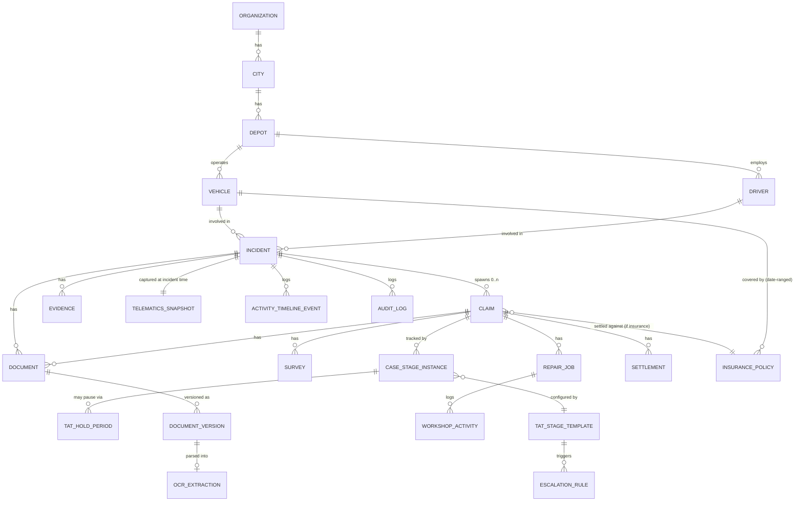

# CM FIM System — Phase 1 Scope & Delivery Plan

Status: **Draft for sign-off** · Owner: Engineering · Tenant at launch: JBM (multi-tenant-ready)

This document is the first deliverable requested by the development brief
("Architecture documentation"). It scopes Phase 1 into ordered, independently
shippable milestones, fixes the confirmed architectural decisions, and lists
what is deliberately deferred or still needs JBM/business input. No
application code is written yet — this is the plan the milestones below will
be built against, one PR at a time.

---

## 1. Confirmed decisions

| Area | Decision |
|---|---|
| Architecture | Modular monolith, single deployable Next.js app + BullMQ worker process. No microservices in Phase 1. |
| Frontend/backend | Next.js (App Router) + TypeScript + Tailwind CSS + shadcn/ui |
| Database | PostgreSQL + Prisma ORM |
| Object storage | S3-compatible (AWS S3 in prod, MinIO in local/dev via docker-compose) |
| Jobs/queues | Redis + BullMQ (reminders, escalations, OCR jobs, telematics polling) |
| WhatsApp | Meta WhatsApp Business **Cloud API**, integrated directly (no BSP), behind a `WhatsAppProvider` adapter |
| OCR | AWS Textract as the default `OCRProvider` implementation, behind a provider interface |
| Telematics | No JBM API access yet → ship a `TelematicsProvider` interface + deterministic stub/sandbox adapter for dev & demo; real JBM adapter is a later milestone once their API spec/credentials are available |
| Email | Provider-abstracted (`EmailProvider`); default implementation via SMTP/SES, configurable via env |
| IDs | UUID primary keys everywhere; human-readable business IDs (`INC-2026-000001`, `CLM-2026-000001`, `SUR-2026-000001`) generated per organization+year |
| Multi-tenancy | Single-tenant deployment for JBM in Phase 1, but every major business table carries `organization_id` from day one so a second tenant is a config change, not a migration |
| This session | **Scope only.** This document is committed for review; no further module is implemented until it's approved. |

---

## 2. Domain model (core entities)

The incident is the one parent record every downstream activity hangs off.
A claim (of any type) is *derived* from an incident, never re-keyed.



Key modeling rules baked into the schema design (Milestone M2):

- `incident` is never deleted or type-narrowed; `claim.claim_type` is an enum
  (`insurance`, `warranty`, `maintenance`, `operational`, `third_party_recovery`,
  `mixed`) and an incident can have **multiple** claims (e.g. one insurance +
  one third-party-recovery claim on the same accident).
- `case_stage_instance` is the generic TAT-tracked unit — one row per
  (claim or incident) × workflow stage, referencing a configurable
  `tat_stage_template` (per org, per case type). This is what makes the TAT
  engine and escalation hierarchy configurable rather than hard-coded.
- `tat_hold_period` records on-hold spans with `reason`, `responsible_party`,
  `started_at`/`ended_at`; TAT-elapsed calculations always subtract held time.
- `document_version` is append-only; `document.current_version_id` points at
  the active version. OCR results land in `ocr_extraction` as **proposed**
  field values with a `verified_by`/`verified_at` pair — they are never
  auto-applied to master data (`vehicle`, `driver`, `policy`, …).
- `telematics_snapshot` is written once at incident-report time and is
  immutable afterward — it is evidence, not a live feed.
- `audit_log` is populated by a single write path (a Prisma middleware /
  service-layer helper), not scattered `console.log`-style calls, so every
  mutating action is guaranteed to be captured the same way.
- Every table above (except pure lookup/enum tables) carries `organization_id`.

---

## 3. Module boundaries (modular monolith)

```
apps/web/                      Next.js app (UI + API routes)
  app/(dashboard)/...          Route groups per persona (corporate/depot/claims)
  app/api/...                  REST/OpenAPI route handlers (thin — delegate to services)
packages/
  domain-auth/                 Auth, RBAC, session, permission checks
  domain-masters/              Org/city/depot/vehicle/driver master data
  domain-documents/            Document repo, versioning, validity tracking
  domain-incidents/             Incident lifecycle, evidence
  domain-claims/                Claim lifecycle, incident→claim conversion
  domain-surveys/               Survey management
  domain-workshop/              Repair/workshop tracking
  domain-tat/                   TAT engine, hold periods, escalation hierarchy
  domain-policies/              Insurance policy repository + date-based selection
  domain-settlement/            Settlement, payment, closure controls
  domain-telematics/            TelematicsProvider interface + adapters (stub, JBM)
  domain-ocr/                   OCRProvider interface + adapters (Textract)
  domain-whatsapp/              WhatsAppProvider interface + Meta Cloud API adapter
  domain-notifications/         EmailProvider interface, reminders, escalations
  domain-audit/                 Audit log write path, query API
  shared-kernel/                organization_id scoping, ID generator, money/date value objects
workers/                       BullMQ worker process (reminders, escalation sweep, OCR jobs, telematics jobs)
prisma/                        Schema + migrations + seed
docs/                          Architecture, ADRs, OpenAPI specs, ER diagrams
```

Rule enforced from Milestone M1 onward: UI components (`apps/web/app/**`)
call domain package services — they never contain business rules, TAT math,
or direct Prisma queries for cross-cutting logic.

---

## 4. Milestone plan

Each milestone below is scoped to be one (or a few) reviewable PR(s), and per
the brief's instruction, **each module's DB schema, API contract, and
business rules/tests are drafted before that module is implemented** —
tracked as the first task inside the milestone, not skipped.

### First create

| # | Milestone | Delivers | Depends on |
|---|---|---|---|
| M1 ✅ | **Foundations** | Repo scaffold (Next.js/TS/Tailwind/shadcn), Docker Compose (postgres, redis, minio, app, worker), `.env.example`, lint/format/test tooling, this scope doc (no separate ADR log — see M1 decisions) | — |
| M2a ✅ | **Database schema — core** | Org/city/depot/vehicle/driver, users, document repository (versioned + OCR), incidents, evidence, telematics snapshot, activity timeline, audit log, human-readable ID generation. See [`docs/schema/M2A.md`](schema/M2A.md). | M1 |
| M2b ✅ | **Database schema — claims lifecycle** | Insurance policies, claims, surveys, workshop/repair jobs, TAT engine (stage templates, hold periods, escalation rules), settlement/payment. See [`docs/schema/M2B.md`](schema/M2B.md). | M2a |
| M3 ✅ | **Auth & RBAC** | Database-backed sessions, credential login/logout, role gating, org-scoping (Prisma Client Extension), protected Server Component/Action/Route pattern. See [`docs/AUTH.md`](AUTH.md). | M2a |
| M4 ✅ | **Vehicle/depot/driver master** | City/Depot/Vehicle/Driver CRUD (service layer + protected API routes + simple list pages), RBAC + depot-scoping, audit logging, tests. Bulk import and full create/edit UI deferred — see [`docs/MASTERS.md`](MASTERS.md). | M3 |
| M5 ✅ | **Document repository** | Presigned-URL upload to S3-compatible storage, versioning (BR-04), validity-date fields, linkage to Vehicle/Driver (Incident/Claim/Survey/RepairJob linking deferred to their own milestones). See [`docs/DOCUMENTS.md`](DOCUMENTS.md). | M4 |
| M6 ✅ | **Incident workflow** | Incident creation/editing, OPEN/CLOSED state machine, evidence attachment (presigned upload, reusing M5's pattern), `INC-YYYY-######` generation. Telematics snapshot deferred to M12. See [`docs/INCIDENTS.md`](INCIDENTS.md). | M4, M5 |
| M7 ✅ | **Claim workflow** | Incident→claim conversion (no re-entry), multi-claim-per-incident, claim types, BR-05 policy auto-selection by incident date, claim state machine (`CLM-YYYY-######`), plus surveys (`SUR-YYYY-######`) and workshop/repair job tracking, shipped alongside. See [`docs/CLAIMS.md`](CLAIMS.md). | M6, M2b |
| M8 ✅ | **TAT engine** | Configurable stage templates per org/case-type, auto-instantiated sequential `case_stage_instance` tracking, on-hold periods with reason/responsible party, elapsed-time calc excluding holds. Escalation firing deferred to M13. See [`docs/TAT.md`](TAT.md). | M7 |
| M9 ✅ | **Dashboards** | One shared operational dashboard (org-wide or depot-filtered, no mocks) — incident/claim status counts, TAT breach counts, aging buckets. See [`docs/DASHBOARDS.md`](DASHBOARDS.md). | M6–M8 |

### Then implement

| # | Milestone | Delivers | Depends on |
|---|---|---|---|
| M10 | **WhatsApp integration** | Meta Cloud API webhook intake, incident creation from WhatsApp messages, media download into evidence store, `WhatsAppProvider` interface | M6 |
| M11 | **OCR/document parsing** | Textract adapter behind `OCRProvider`, async extraction job, human-verification UI, master-data protection (no silent overwrite) | M5, BullMQ from M1 |
| M12 | **Telematics adapter + JBM integration** | `TelematicsProvider` interface, stub adapter for dev/demo, incident-time snapshot capture job, JBM adapter stub (real impl pending API access) | M6 |
| M13 | **Notifications/escalations** | Reminder scheduler, configurable escalation hierarchy wired to `case_stage_instance` breaches, email delivery via `EmailProvider` | M8 |
| M14 | **Payment & closure** | Settlement/payment recording, reconciliation, closure-blocking rule (no final closure until settlement satisfied) | M7, M8 |
| M15 | **Testing & deployment hardening** | Full test pass (unit/integration/e2e), OpenAPI doc generation, JBM seed dataset, deployment docs, README/runbook | All prior |

Survey management and workshop/repair tracking are delivered inside M7/M8's
claim-lifecycle slice rather than as standalone milestones, since they are
sub-workflows of a claim with their own TAT stages — they get their own
schema/API-contract/tests pass but ship alongside the claim workflow PR(s).

---

## 5. Adapter interface contracts (shape, not implementation)

Fixed now so downstream milestones code against a stable contract:

```ts
interface WhatsAppProvider {
  verifyWebhook(query: Record<string, string>): string | null;
  handleIncomingMessage(payload: unknown): Promise<NormalizedInboundMessage>;
  sendMessage(to: string, message: OutboundMessage): Promise<{ providerMessageId: string }>;
}

interface OCRProvider {
  extract(documentVersionId: string, fileRef: StorageRef): Promise<{
    fields: Array<{ key: string; value: string; confidence: number }>;
    rawResponseRef: StorageRef;
  }>;
}

interface TelematicsProvider {
  getSnapshotAt(vehicleExternalId: string, atTimestamp: Date): Promise<TelematicsSnapshotData>;
  // Stub adapter (Phase 1 default) returns deterministic seeded data;
  // JbmTelematicsProvider implements the same interface once JBM's API is available.
}

interface EmailProvider {
  send(message: { to: string[]; subject: string; html: string; attachments?: StorageRef[] }): Promise<void>;
}
```

All four are resolved via env-based config (`WHATSAPP_PROVIDER`,
`OCR_PROVIDER`, `TELEMATICS_PROVIDER`, `EMAIL_PROVIDER`) — never hardcoded
imports in domain code, so a provider swap is a config change plus a new
adapter class.

---

## 6. RBAC roles (initial set, Milestone M3 will finalize permissions matrix)

`SuperAdmin` (cross-org, support only) · `OrgAdmin` · `DepotManager` ·
`ClaimsManager` · `Surveyor` · `WorkshopCoordinator` · `FinanceOfficer` ·
`Auditor` (read-only, full audit-log access) · `WhatsAppBot` (system
principal for inbound-message-created incidents).

---

## 7. Non-functional commitments

- **Audit trail**: single write path (`domain-audit`), invoked from every
  mutating service call, capturing actor, org, entity, before/after diff,
  timestamp, source (UI/API/WhatsApp/system).
- **No mock data in production code paths** — seed scripts are dev/demo-only
  and clearly separated (`prisma/seed/`); adapters without real credentials
  fail closed or use an explicitly-named stub provider, never silent fake data.
- **OpenAPI**: generated from the route-handler layer for every external
  API surface (webhooks, integration endpoints), published under `docs/openapi/`.
- **Testing**: business-rule and TAT-calculation logic gets unit tests in
  the owning domain package; workflow milestones (incident, claim, TAT,
  closure) get integration tests against a real Postgres test container.

---

## 8. Open questions for JBM / business sign-off

These don't block M1–M9 (which don't need them) but do block the *real*
implementations of M10–M12:

1. **WhatsApp Business number**: is a Meta-verified WhatsApp Business number
   already provisioned for JBM, or does that need to happen in parallel?
2. **JBM telematics API**: no docs/credentials available yet — who is the
   technical contact once ready to build the real adapter?
3. **Insurance policy documents**: source format for bulk policy import
   (PDF schedules, insurer API, manual entry)?
4. **Escalation hierarchy**: org chart / roles to escalate to per stage —
   needed to seed `escalation_rule` realistically for the demo dataset.
5. **Approval authority for settlement/closure**: who signs off financially
   before a claim can close (affects `domain-settlement` permission checks)?

---

## 9. Explicitly out of scope for Phase 1

- Microservices split, multi-region deployment, active second tenant.
- Native mobile app (WhatsApp is the only mobile-friendly incident-entry
  channel in Phase 1, per business rule #13).
- Driver-facing self-service portal beyond WhatsApp reporting.
- Real-time telematics streaming (Phase 1 is snapshot-at-incident only, per
  business rule #9/#14).

---

## Next step

On sign-off of this document, work proceeds milestone-by-milestone starting
with **M1 (Foundations)**, each landing as its own PR with schema/contract/
tests drafted before the corresponding implementation, per the brief's
development approach.
