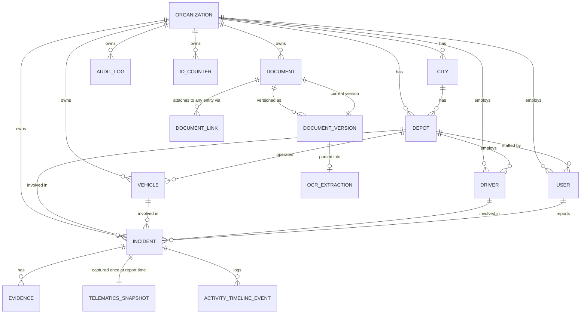

# Database Schema — M2a

Status: implemented (`prisma/schema.prisma`, migration
`20260808180526_m2a_masters_documents_incidents`) · verified against a real
Postgres instance via `prisma/schema.smoke.test.ts`.

Covers: organization/city/depot structure, users, vehicle/driver master
data, the document repository (versioned, with OCR), incidents, evidence,
telematics snapshots, activity timeline, audit log, and human-readable ID
generation.

Deferred to **M2b**: insurance policies, claims, surveys, workshop/repair
jobs, the TAT engine, and settlement/payment.

## Entity relationship diagram

`DOCUMENT_LINK` and `AUDIT_LOG.entityId` are deliberately **not** drawn with
FK arrows to the entities they reference (Vehicle, Driver, Incident, and
eventually Policy/Claim/Survey/RepairJob) — see "Generic references" below.

## Design decisions and why

**Human-readable IDs generated via `IdCounter`, not a DB sequence/trigger.**
A small `id_counters` table (`organizationId`, `entityType`, `year`,
`lastNumber`) is incremented with `upsert` inside the same transaction as
the record insert. Simpler and more portable than dynamically creating a
Postgres sequence per org/type/year, and easy to unit test (see
`schema.smoke.test.ts`'s uniqueness test). Implements the ID format from
`docs/SCOPE.md` (`INC-2026-000001`).

**Generic references for `DocumentLink` and `AuditLog`.**
A document can attach to many different entity types — including Policy,
Claim, Survey, and RepairJob, which don't have tables until M2b — and an
audit log entry can reference *any* auditable entity in the system. Rather
than a wide table of nullable FK columns (one per possible target type,
growing every time a new linkable entity is added), both use a
`(linkedEntityType/entityType, linkedEntityId/entityId)` pair with **no
database-level foreign key** on the ID column. Referential integrity for
these links is enforced in the owning service layer (`domain-documents`,
`domain-audit`), not the database. This was a deliberate trade-off — see
the chat record for the alternative considered (fixed nullable FK columns)
and why it was rejected for Phase 1.

**`Document` / `DocumentVersion` cyclic reference.**
`Document.currentVersionId` points at the active `DocumentVersion`, while
every version also points back at its parent `Document` — implementing
BR-04 (documents are versioned, never overwritten in place). The cycle is
resolved by creating the `Document` row first, then its first
`DocumentVersion`, then updating `currentVersionId` — all within one
transaction. `currentVersionId` is nullable to allow that intermediate
state.

**`OcrExtraction` stores proposed values only.**
`extractedFields` is a JSON array of `{ key, value, confidence }`, with
`status` and `verifiedBy`/`verifiedAt` columns. Nothing in this schema lets
an OCR result write directly to `Vehicle`, `Driver`, or any other master
table — that write only happens via an explicit, human-verified service
call in a later milestone. Implements BR-07.

**`TelematicsSnapshot` is 1:1 with `Incident` and has no update path in the
domain layer.** `capturedAt` and `rawPayload` are written once, at
incident-report time. Implements BR-06.

**`User.passwordHash` exists now; auth logic is M3.**
Nearly every other table needs to reference `User` by FK (who uploaded a
document, who reported an incident, who verified an OCR result, ...), so
the table has to exist in M2. The actual login/session/hashing behavior is
implemented in M3 — this milestone only defines the shape.

**`ActivityTimelineEvent` is scoped to `Incident` only, for now.**
The full communication/activity timeline (per `docs/SCOPE.md`'s domain
model) also covers claims, but `Claim` doesn't exist until M2b. Rather than
model this as a generic reference like `DocumentLink` (losing FK integrity
for no real benefit, since there are only ever two possible parents), M2b
will add a nullable `claimId` column onto this same table once `Claim`
exists — an additive, non-breaking migration.

## Verification

`prisma/schema.smoke.test.ts` exercises the full chain — org → city → depot
→ user → vehicle/driver → document + version + OCR + link → incident (with
a real `IdCounter`-generated number) → evidence → telematics snapshot →
timeline event → audit log — against a real Postgres instance, and asserts
the `IdCounter` uniqueness constraint actually rejects a duplicate
`(organizationId, entityType, year)`. Everything runs inside a transaction
that's always rolled back, so the test suite never leaves data behind.

Requires `DATABASE_URL` to point at a running Postgres
(`docker compose up postgres -d`, or any Postgres 16+ instance).
