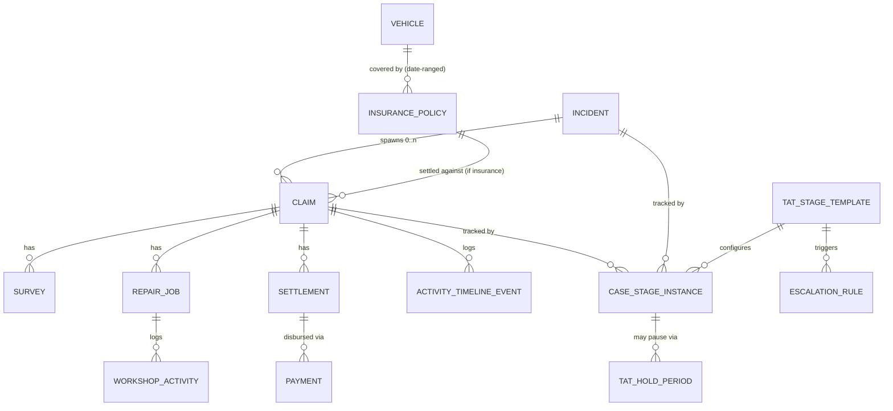

# Database Schema — M2b

Status: implemented (`prisma/schema.prisma`, migration
`20260808181811_m2b_claims_surveys_workshop_tat_settlement`) · verified
against a real Postgres instance via `prisma/schema.m2b.smoke.test.ts`.

Covers: insurance policies, claims, surveys, workshop/repair jobs, the TAT
engine (stage templates, case-stage instances, hold periods, escalation
rules), and settlement/payment. Builds on M2a — see
[`docs/schema/M2A.md`](M2A.md).

## Entity relationship diagram



## Design decisions and why

**`CaseStageInstance` and `ActivityTimelineEvent` use real nullable-FK
pairs plus a hand-added CHECK constraint — not a generic reference like
`DocumentLink`.** Both have exactly two possible parents (an `Incident` or
a `Claim`), unlike `DocumentLink`/`AuditLog`, which need to reference an
open-ended set of entity types. With only two options, a wide generic
reference would throw away real DB-enforced integrity for no benefit. Each
table gets a nullable `incidentId` and a nullable `claimId`, both real
foreign keys, plus:

```sql
ALTER TABLE "case_stage_instances" ADD CONSTRAINT "case_stage_instances_subject_check"
  CHECK (("incidentId" IS NOT NULL AND "claimId" IS NULL) OR
         ("incidentId" IS NULL AND "claimId" IS NOT NULL));
```

Prisma has no declarative schema syntax for arbitrary `CHECK` constraints
yet, so this was added by hand to the migration SQL via
`prisma migrate dev --create-only` (generate the migration without
applying it, edit the `.sql` file, then apply). `schema.m2b.smoke.test.ts`
asserts the database actually rejects both "neither set" and "both set"
inserts — this isn't just a comment, it's enforced at the DB layer, so a
future bug in application code can't silently create an orphaned stage or
timeline event.

**One `InsurancePolicy` row per vehicle.** Phase 1 doesn't model
fleet/blanket policies that cover multiple vehicles under one policy
number — `InsurancePolicy.vehicleId` is required. This was a deliberate
scope cut: JBM's actual policy structure (fleet vs. per-vehicle) wasn't
available to design against yet, and per-vehicle is the simpler, safer
default for BR-05's auto-selection query
(`(vehicleId, coverageStartDate, coverageEndDate)`). If JBM turns out to
use blanket policies, this needs a real schema change (likely a
`PolicyVehicle` join table) — flag this early if/when real policy
documents are available.

**Workshops are free-text fields on `RepairJob`, not a master entity.**
Unlike `Vehicle`/`Driver`, which the brief explicitly requires as master
data, a "workshop master" isn't a stated Phase 1 deliverable. Adding one
now would be building structure ahead of a need. Migrating later is cheap:
add a `Workshop` table, backfill `workshopId` from the existing name
strings, drop the text columns.

**Money columns carry an explicit `currency` (default `"INR"`), stored as
`Decimal(14, 2)`.** Every money-bearing column (`InsurancePolicy.premiumAmount`/
`sumInsuredAmount`, `RepairJob.estimatedCost`/`approvedCost`/`actualCost`,
`Settlement.settlementAmount`, `Payment.amount`) uses `Decimal`, never
`Float` (binary floating point loses cents-level precision on currency
math), and carries a `currency` column rather than assuming INR forever —
consistent with the org_id-everywhere multi-tenancy stance in
`docs/SCOPE.md`. Cheap today (one column per table); expensive to retrofit
later if a second tenant needs a different currency.

**`Claim` allows multiple `Settlement`s.** Rather than forcing exactly one
settlement per claim, `Settlement.claimId` is a plain many-to-one — this
allows an interim settlement followed by a final one, which is normal for
larger insurance claims. BR-09 (no closure without settlement) is a
business-rule check the `domain-settlement` service makes at closure time
(e.g. "every settlement is `ACCEPTED` and its payments sum to the
settlement amount and are all reconciled") — the schema doesn't and
shouldn't try to encode that logic itself. (`APPROVED` was this
milestone's original guess at the status name; M19 corrected it to
`ACCEPTED` — JBM records a response to the insurer's offer, not an
approval decision. See `docs/PAYMENTS.md`.)

**`EscalationRule` is configuration only — no `EscalationEvent` log yet.**
This milestone defines *what* should happen when a stage's TAT is
breached (which level, after how many hours, notify which role/user, via
which channel). The table recording that an escalation actually *fired*
belongs to M13 (Notifications/escalations), when there's a real firing
mechanism to log against — adding it now would be a table with no writer.

**`Survey.surveyorName` is always a plain string; `surveyorUserId` is
optional.** Surveyors are frequently external agency reps with no CM FIM
System account. Rather than forcing every survey to reference a `User`,
the display name is always captured directly, and `surveyorUserId` is set
only when the surveyor happens to be an internal system user.

## Verification

`prisma/schema.m2b.smoke.test.ts` covers three cases, all against a real
Postgres instance inside a transaction that's always rolled back:

1. The full chain — policy → claim (with a real `IdCounter`-generated
   `CLM-2026-######`) → survey (`SUR-2026-######`) → repair job + workshop
   activity → TAT stage template → case-stage instance (attached to the
   claim) + hold period → escalation rule → claim-scoped timeline event →
   settlement → payment.
2. `CaseStageInstance` rejects both "incidentId and claimId both set" and
   "neither set".
3. `ActivityTimelineEvent` rejects "neither incidentId nor claimId set".

Requires `DATABASE_URL` to point at a running Postgres
(`docker compose up postgres -d`, or any Postgres 16+ instance).
